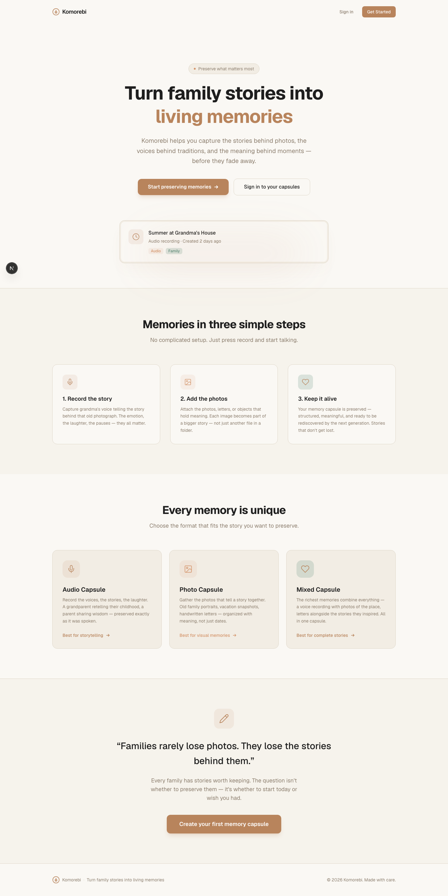

# Komorebi

> 木漏れ日 — Sunlight filtering through leaves.

Turn family stories into living memory capsules — structured archives of voice recordings, photos, and the moments that made them matter.



---

## How it works

**Create** → **Add media** → **Edit** → **Share**

1. **Create a capsule** — 3-step wizard: pick a memory date, write a title, choose a type (audio / photo / mixed)
2. **Add media** — record audio (30s–3min) or upload photos (up to 10) into a scrapbook-style album
3. **Edit** — update title and description anytime
4. **Share** — toggle public and get a shareable link — anyone with the link can view, no account needed

---

## Getting started

```bash
# 1. Clone and install
git clone <repo-url> && cd komorebi && npm install

# 2. Start local Supabase
supabase start

# 3. Configure environment
cp .env.example .env
# Fill in NEXT_PUBLIC_SUPABASE_URL and NEXT_PUBLIC_SUPABASE_ANON_KEY
# from the supabase start output

# 4. Disable email confirmation
# In http://localhost:54323 → Authentication → Providers → Email → toggle OFF

# 5. Run
npm run dev
```

Open [http://localhost:3000](http://localhost:3000).

| Command | What it does |
|---------|-------------|
| `npm run dev` | Dev server (hot reload) |
| `npm run build` | Production build |
| `npm run lint` | ESLint |

---

## Tech stack

| Layer | Technology |
|-------|-----------|
| Frontend | Next.js 16 (App Router), React 19, TypeScript, Tailwind CSS v4 |
| Backend | Supabase (Auth + Postgres + Storage) |
| Audio | MediaRecorder API — Opus, 96kbps, mono |
| Images | Client-side compression (max 1600px, JPEG 0.85) |

---

## Project structure

```
src/
├── app/
│   ├── page.tsx                  # Landing page
│   ├── dashboard/page.tsx        # Stats + capsule grid
│   ├── capsules/
│   │   ├── new/page.tsx          # Create capsule (3-step wizard)
│   │   └── [id]/page.tsx         # Album view + edit/share
│   ├── share/[token]/
│   │   ├── page.tsx              # Public read-only view (no auth)
│   │   └── not-found.tsx         # Friendly "not found" page
│   ├── login/page.tsx
│   ├── signup/page.tsx
│   └── profile/page.tsx
├── components/
│   ├── CreateCapsuleForm.tsx     # 3-step wizard
│   ├── AudioRecorder.tsx         # Record → upload pipeline
│   ├── AudioPlayer.tsx           # Custom player with seek + ARIA
│   ├── ImageUploader.tsx         # Drag-drop + compression
│   ├── MediaAlbum.tsx            # Polaroid-style masonry album
│   ├── EditCapsuleModal.tsx      # Edit title/description
│   ├── ShareButton.tsx           # Toggle public + copy link
│   └── ...                       # Logo, CapsuleCard, DeleteButton, etc.
├── lib/supabase/                 # Client, server, middleware
└── middleware.ts                  # Auth (skips /share for anon)

supabase/migrations/              # 5 migrations (schema, storage, profiles, sharing)
```

---

## Data model

```
capsules        → id, user_id, title, description, type, memory_date, is_public, share_token, created_at
media_items     → id, capsule_id, type, url, order_index, created_at
profiles        → id, full_name, avatar_url, created_at, updated_at
```

- 1 audio + 10 photos max per capsule
- Media belongs to a capsule only — no standalone browsing
- Public capsules are readable by anonymous users via RLS

---

## Design tokens

Warm, organic palette defined in `globals.css`. Use Tailwind tokens (`text-primary`, `bg-surface`) — never hardcoded colors.

| Token | Light | Dark |
|-------|-------|------|
| `--primary` | `#B8845C` | `#D4A07A` |
| `--surface` | `#F2EDE4` | `#1C211E` |
| `--background` | `#FAF8F4` | `#141816` |
| `--muted` | `#8C7E6E` | `#9A9488` |

---

## Environment variables

| Variable | Required | Description |
|----------|----------|-------------|
| `NEXT_PUBLIC_SUPABASE_URL` | Yes | Supabase project URL |
| `NEXT_PUBLIC_SUPABASE_ANON_KEY` | Yes | Supabase anon key |
| `GITHUB_PAT` | No | GitHub token for MCP tools |
| `MAGIC_API_KEY` | No | 21st.dev API key |

---

## License

Private — not for distribution.
