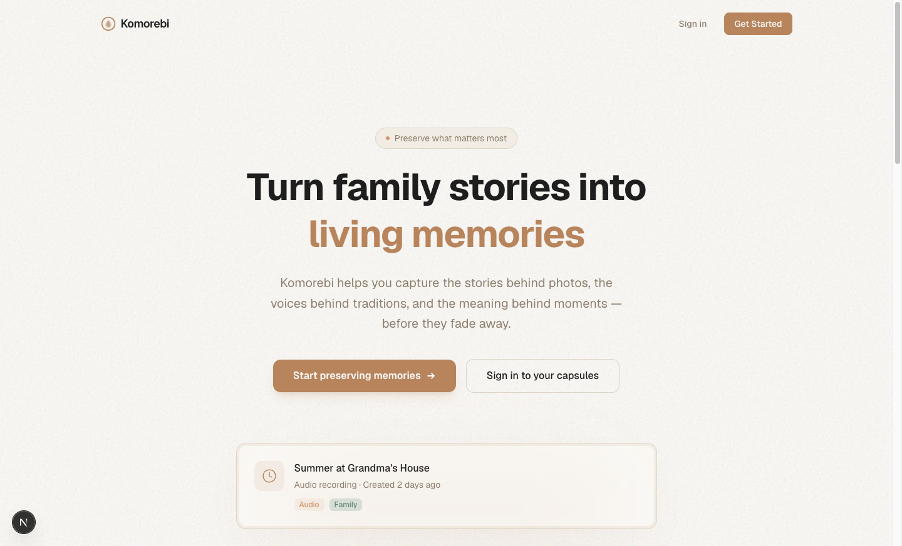
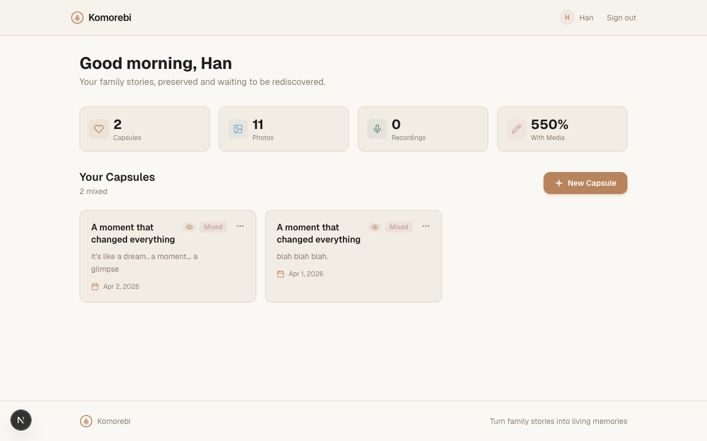
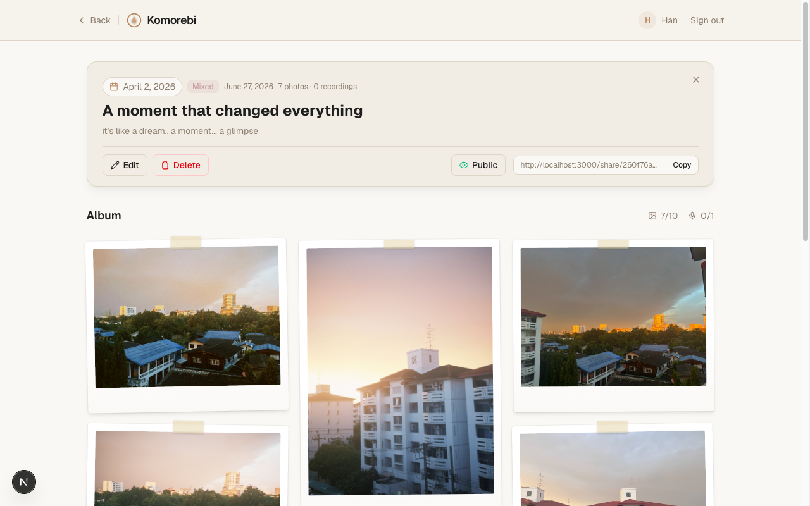
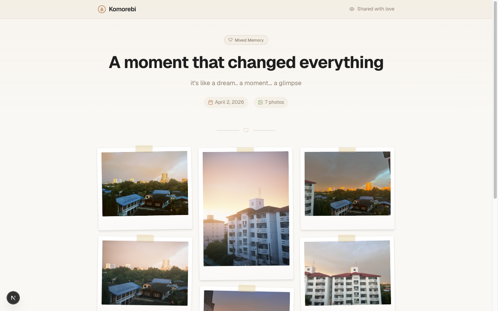

<!--
  Marp template — "terminal-dark"
  Copy this file into your repo (e.g. slides/intro.md) and replace the content.
  Render:  marp slides/intro.md -o slides.html      (or .pdf / .png)
  Theme is self-contained in the <style> block below — no external CSS needed.
-->
---
marp: true
paginate: true
size: 16:9
---

<style>
@import url('https://fonts.googleapis.com/css2?family=JetBrains+Mono:wght@400;500;700&family=Inter:wght@400;600;800&display=swap');
:root {
  --bg:#0d1117; --ink:#e6edf3; --muted:#8b949e;
  --accent:#3fb950; --accent2:#58a6ff; --line:#30363d; --code:#161b22;
}
section {
  background:var(--bg); color:var(--ink);
  font-family:'Inter','Noto Sans','Pyidaungsu',sans-serif;
  font-size:27px; line-height:1.5; padding:56px 72px;
}
h1,h2,h3 { font-family:'JetBrains Mono',monospace; }
h1 { color:var(--accent); font-weight:700; border-bottom:3px solid var(--line); padding-bottom:.2em; }
h2 { color:var(--accent2); font-weight:500; }
h3 { color:var(--ink); }
strong { color:var(--accent); }
a { color:var(--accent2); text-decoration:none; }
code { background:var(--code); color:var(--accent); padding:.06em .35em; border-radius:5px; font-family:'JetBrains Mono',monospace; }
pre  { background:var(--code); border:1px solid var(--line); border-radius:10px; }
pre code { background:none; color:#e6edf3; }
blockquote { border-left:4px solid var(--accent); background:#11161d; color:var(--muted); padding:.5em 1em; }
table th { background:#161b22; color:var(--accent2); }
table td, table th { border-color:var(--line); }
header,footer,section::after { color:var(--muted); font-size:.5em; }
section.cover {
  background:radial-gradient(900px 400px at 80% 12%, rgba(63,185,80,.18), transparent 60%), var(--bg);
}
section.cover h1 { border-bottom:none; font-size:2.3em; }
section.cover .tags code { background:#11161d; color:var(--accent2); margin-right:.4em; }
section.lead { background:#11161d; }
section.lead h1 { border-bottom:none; }
</style>

<!-- _class: cover -->

# Komorebi

## Turn family stories into living memories — structured capsules of voice, photos, and the moments that made them matter.

**Han Min Myat** · @hanminmyat

<span class="tags">`#built-with-claude` `#vibecode.tours`</span>

---

# The Problem

**Families rarely lose photos. They lose context.**

| They do | What's missing |
|---|---|
| Take photos → store → forget | Why this photo mattered |
| Record audio → never revisit | The story behind the voice |
| Keep objects in drawers | Who it belonged to, when, why |

> *Family history doesn't vanish in a fire — it fades in silence.*

---

# Who It's For

<div style="display:grid; grid-template-columns:1fr 1fr; gap:40px;">

<div>

### 📱 The Person Holding the Phone
- Grandchildren
- Adult children
- Family archivists
- **The one capturing, not the one telling**

</div>

<div>

### 🎙️ The Storyteller
- Grandparents
- Parents
- Relatives
- **Their future self**

</div>

</div>

---

# What I Built

**Komorebi** — *木漏れ日* — sunlight filtering through leaves.

Memories are not stored as perfect records — they appear gradually through stories, objects, and conversations.

### Core: Memory Capsules
- 🎙️ **Audio capsule** — record a voice, preserve a story
- 📷 **Photo capsule** — photos that hold meaning together
- 🎛️ **Mixed capsule** — voice + photos, one structured memory
- 🔗 **Share** — public capsule links for family to discover

---

# How It Works

```bash
git clone https://github.com/hanminmyat/komorebi
cd komorebi
npm install
npm run dev
# open http://localhost:3000
```

### The Core Flow

```
Record → Upload → Supabase Storage → Attach to Capsule → Playback
```

| Layer | Tech |
|---|---|
| Frontend | Next.js (App Router) · TypeScript · Tailwind CSS |
| Backend | Supabase (Auth + Database + Storage) |
| Media | Audio recording · Image upload · Album ordering |

**Built entirely with Claude Code** — senior engineer in the terminal.

---

# Principles

### We're building a **memory structuring system**, not a media platform.

<div style="display:grid; grid-template-columns:1fr 1fr; gap:24px;">

<div>

✅ **Memory > media**
Stories matter more than file counts

✅ **Structure > storage**
Context, order, and meaning over folders

</div>

<div>

✅ **Emotion > quantity**
One meaningful capsule beats ten empty ones

✅ **Simplicity > features**
Bounded creation, not infinite uploads

</div>

</div>

---

<!-- _class: lead -->

# Landing



# Dashboard



---

<!-- _class: lead -->

# Memory Capsule



---

<!-- _class: lead -->

# Public Sharing



---

# Links

| | |
|---|---|
| **Repo** | [github.com/hanminmyat/komorebi](https://github.com/hanminmyat/komorebi) |
| **Live** | `npm run dev` → https://komorebi-one-sable.vercel.app/ |
| **License** | MIT |
| **Slides** | `slides/intro.md` · `slides/pitch.md` |
| **Report** | `slides/report.md` |

